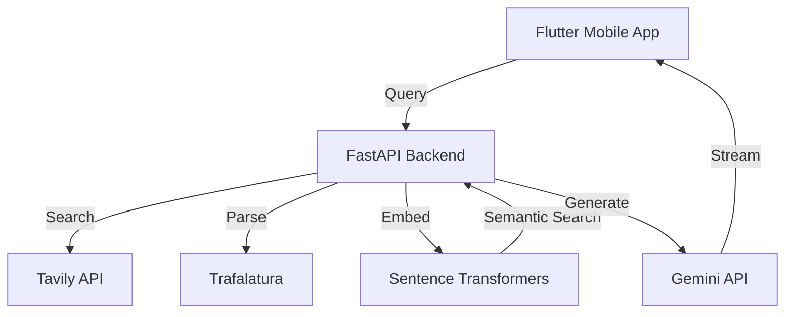

# Jaspr

**A Retrieval-Augmented Generation (RAG) AI Mobile App**  
_Built with Flutter + FastAPI | Powered by Gemini, Tavily, Sentence Transformers_

---

## Overview

Jaspr is an AI-powered mobile application that combines **real-time retrieval, semantic search, and generative AI** to deliver context-aware, source-backed answers.

It bridges a **Flutter frontend** and **FastAPI backend** with WebSocket streaming for instant, interactive responses.

---

## ✨ Features

- 🔎 **Retrieval-Augmented Generation (RAG):** Combines search + LLMs for accurate, grounded responses.
- 🌐 **Tavily API Integration:** Retrieves high-quality URLs & knowledge sources.
- 📄 **Trafalatura HTML Parsing:** Extracts clean text from web pages.
- 🧠 **Sentence Transformers (all-MiniLM-L6-v2):** Embeddings + cosine similarity search for semantic retrieval.
- 🤖 **Gemini API:** Generates context-rich answers with sources.
- ⚡ **WebSockets:** Delivers streaming responses in real-time.
- 📱 **Cross-platform Flutter Frontend:** Modern UI with smooth interactions.

---

## 🛠️ Tech Stack

- **Frontend:** Flutter
- **Backend:** FastAPI + WebSockets
- **APIs:** Tavily API, Gemini API
- **NLP:** Sentence Transformers (all-MiniLM-L6-v2)
- **Parsing:** Trafilatura

---

## ⚙️ Architecture



## Quick Start

Here's how you can quickly set it up and run the backend (FastAPI) as well as the frontend (Flutter).

---

### 🔹 Backend (FastAPI)

1. Once you clone , cd to the server directory :
   ```bash
   cd server
   ```
2. In the server directory, create a python virtual environment (Venv). Recommending this to avoid version issues and to make sure one has all the dependencies.

   ```bash
   python -m venv venv
   source venv/bin/activate   # Linux/Mac
   venv\Scripts\activate      # Windows
   ```

3. Install dependencies from requirements.txt :

   ```bash
   pip install -r requirements.txt
   ```

4. Start the server :

   ```bash
   uvicorn main:app -reload
   ```

5. All set :
   If things are good, the backend should now be running at [text](http://127.0.0.1:8000)

### 🔹 Frontend (Flutter)

1. cd into the frontend directory

   ```bash
   cd frontend
   ```

2. Install flutter dependencies :

   ```bash
   flutter pub get
   ```

3. Run the flutter app
   ```bash
   flutter run
   ```
